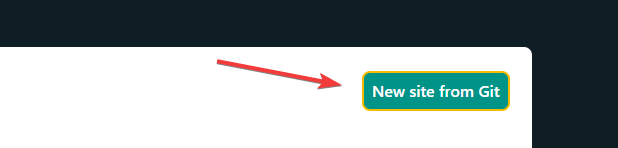
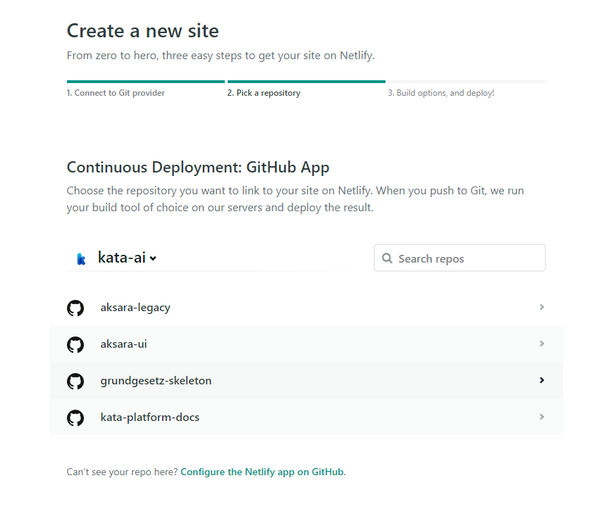
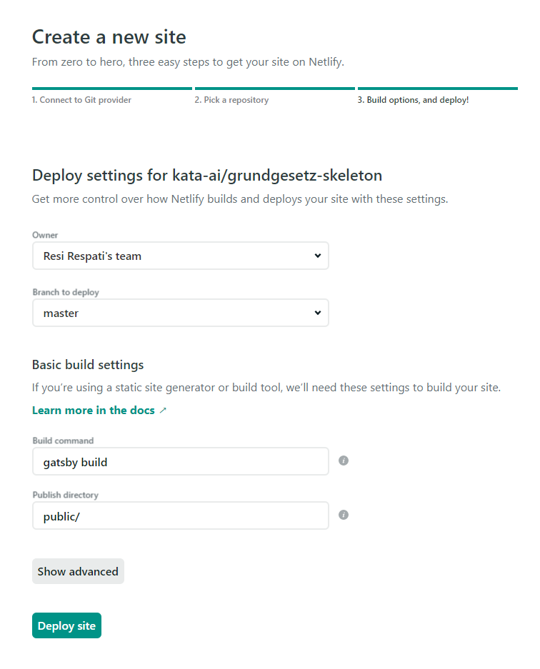
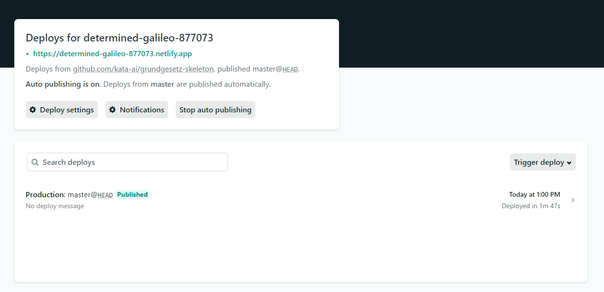

The following page contains guides on how to deploy Grundgesetz to any host that you prefer.

## Static Host

If you have a static site host (like Amazon S3) lying around, deploying is really easy. After running `yarn build`, take everything inside the generated `public/` folder and upload them into your static host.

## Netlify

[Netlify](https://www.netlify.com/) is an all-in-one platform for building modern web projects. Once [you've set up your repository](/getting-started/installation), go to the [Netlify dashboard](https://app.netlify.com/) and click "New site from Git".

If you haven't connected your GitHub/GitLab/Bitbucket account into Netlify, you will now be asked to do so. After connecting your Git account, you will now see a list of repositories that you have. Select the repo that you set up earlier.

On the next screen, select the branch you would like to deploy. Netlify will automatically fill in the build command and publish directory based on the framework used. And finally, click "Deploy site".

Congratulations, you've set up your new documentation website! Now, sit back as Netlify builds and deploys your site. Once completed, you will see a domain generated by Netlify for your new documentation site. Click it, and you should see your new documentation website.

## Vercel

[Vercel](https://vercel.com/) is a cloud platform for static websites and serverless functions. Read the [guides](https://vercel.com/guides/deploying-gatsby-with-vercel) provided by Vercel to walk you through deploying your documentation site to Vercel.
